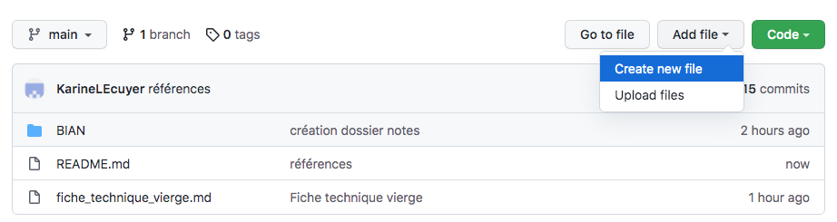
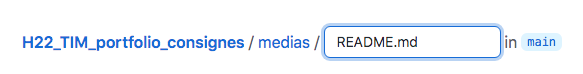

# COMMENT CRÉER UN DOSSIER

1.	À partir du dossier principal, cliquer sur Add file
2.	Sélectionner Create New File 
3.	Taper le nom souhaité pour le dossier suivi d'une barre oblique /
4.	Créer un fichier README.md pour décrire le contenu du dossier  
5.	Ajouter les fichiers voulus dans le dossier créé

