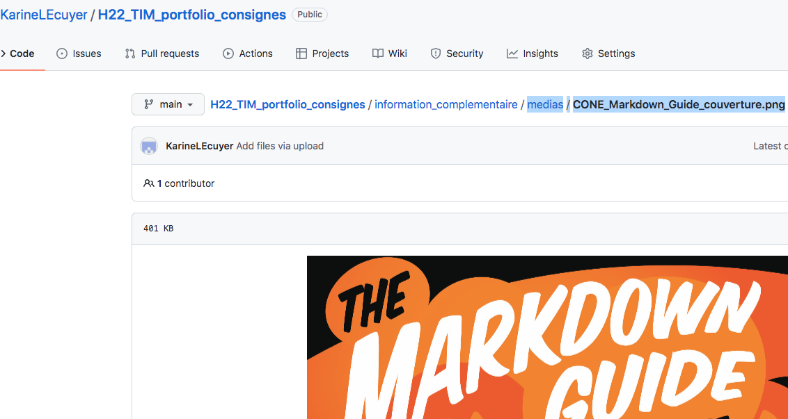
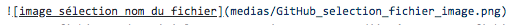

# Comment intégrer une photographie dans un fichier .md

1. La photographie doit être dans un dossier de votre *repository*. Il est important que son nom soit déjà clair et bien composé avant de la mettre dans le dossier. Le nom du fichier **ne doit pas comporter d'espace**.
3. Allez au fichier photo que vous souhaitez insérer dans le fichier .md.
4. Surlignez avec votre souris le chemin du fichier photo et copiez ce texte (Ctrl+C)

5. Dans votre fichier .md, voici la syntaxe qui vous permet d'intégrer votre fichier image : 

Le texte entre crochets est un texte qui décrit ce que vous insérez. Ce qui se trouve entre parenthèses est le chemin que vous aviez copié et que vous collez (Ctrl+V)

Vous avez maintenant intégré votre fichier de la bonne façon !
