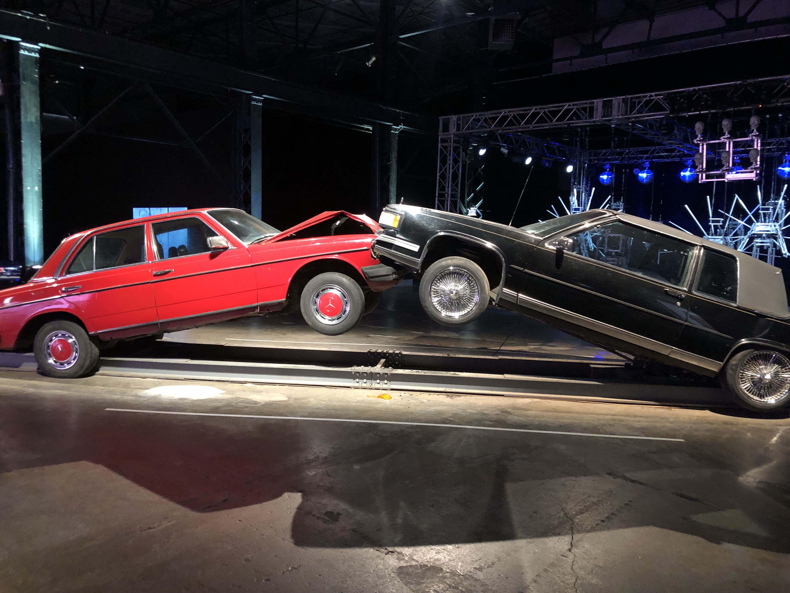
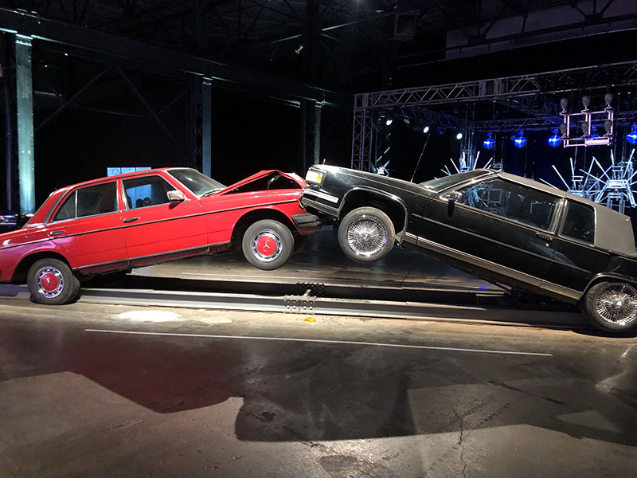
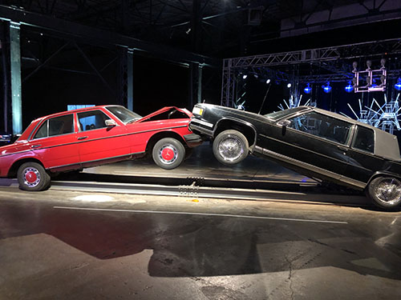

# Format des images dans GitHub

Ce dossier contient 4 fichiers de dimensions différentes de la même photographie de l'oeuvre *[Slow-Motion Car Crash](https://www.jonathanschipper.com/car-crash)* de [Jonathan Schipper](https://www.jonathanschipper.com/) (Arsenal art contemporain, BIAN, 2022).
Ce dossier contient:
- 4 fichiers de dimensions différentes de la même photographie de l'oeuvre *[Slow-Motion Car Crash](https://www.jonathanschipper.com/car-crash)* de [Jonathan Schipper](https://www.jonathanschipper.com/) (Arsenal art contemporain, BIAN, 2022).
- 1 fichier pdf qui illustre les manipulations à faire pour redimensionner simplement une image avec le logiciel *Photoshop*

Toutes les photographies sont en 72 ppp. 
Tous les fichiers des photographies sont en 72 ppp. 

À savoir : il y a une limite de stockage pour les répertoires GitHub gratuits (comme les nôtres). Mieux vaut bien classer les fichiers originaux dans notre ordinateur et dans notre stockage infonuagique (*cloud*) et mettre un format réduit dans le répertoire.

## Voici l'apparence du fichier original sans redimensionnement 
(à noter : il y a réduction automatique des très grands formats pour les ajuster automatiquement à la largeur d'affichage du fichier .md. Voir le fichier de cette photo dans ce dossier pour constater sa grandeur réelle)
**4032 pixels x 3024 pixels, 72 ppp**

## Modification de la taille du plus large côté (donc ici la largeur de la photo)
**1200 pixels x 900 pixels, 72 ppp**

**800 pixels X 600 pixels, 72 ppp**

**500 pixels x 375 pixels**

> Photo par Karine L'Ecuyer, février 2023
