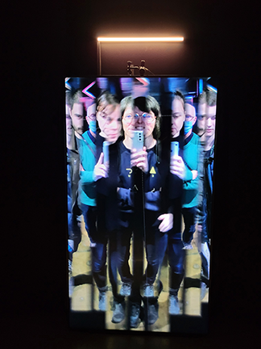
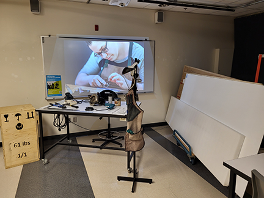

# Josianne Blouin

Photo prise devant l'oeuvre *Bilateral Time Slicer* de Rafael Lozano-Hemmer, BIAN, janvier 2023

## Intérêts dans le domaine du multimédia
Ce domaine est pour moi un champ de découvertes sans cesse renouvellé. J'aime la créativité et le caractère innovateur que le numérique apporte aux artistes. En exposition, le multimédia est un support qui permet aux visiteurs de s'engager et d'entrer en relation avec divers contenus.

## Ce que j'aime d'enseigner la muséologie en TIM
Permettre aux étudiants d'aiguiser leur regard sur les oeuvres et dispositifs multimédias en exposition et qu'ils et elles voient tous les petits éléments à soigner dans la mise en exposition pour une meilleure expérience des visiteurs. J'ai hâte de vous faire découvrir l'envers du décor muséologique.

Photo prise dans les locaux de muséologie lors des dernières porte-ouvertes du Collège.
